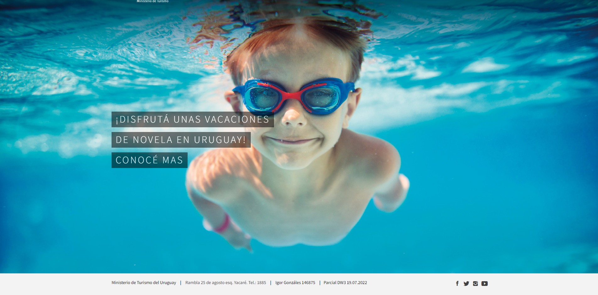

# Parcial DW3 2022

El ministerio de turismo está trazando diferentes estrategias para captar turismo internacional e interno y nos solicitan realizar algunos cambios a uno de sus sitios web, Nos han compartido el siguiente repositorio en github.

#

## Levantar el local - 2pts

A patir de uy.zip en este repositorio y levantar una copia del sitio dónde vamos a realizar los cambios que solicita el ministerio.

#

## Bootstrap SASS - 5pts

Los desarrolladores anteriores nos entregaron el archivo `style.css` de distribución ya compilado pero para trabajar debemos trabajar con los archivos de scss.

Utilizar `Node Package Manager` para instalar las dependencias del proyecto:

-   node-sass
-   bootstrap

Explorar la carpeta `scss/` y crear un script en `package.json` para unir todos los parciales en un único archivo minificado `style.css`. Puede ser necesario crear un archivo `scss` como controlador.

Completar con sus datos `_comentarios.scss`

#

## Cambios de color y tipografía - 5pts

Los cambios principales que el ministerio quiere hacer sobre las variables de Bootstrap son los siguientes:

```
- Colores
Color Principal:  rgba(0, 82, 140, 1)
Color Secundario: #fdb935
Hover del menú:   #008cba

- Tipografía
Títulos:  Roboto Slab
Párrafos: Roboto
```

#

## Etiquetas de contenido - 3pts

Crear 4 etiquetas para las `Entradas` (Posts)

-   Ciudades
-   Playas
-   Naturaleza
-   Tradiciones

Explorar las `Entradas` y asignar una o más etiquetas siendo coherentes con el contenido.

#

## Home - 10pts

-   El equipo de SEO nos pidió cambiar el párrafo del hero por un título.

-   El equipo de contenidos nos pide vincular el archive de cada etiqueta con su correspondiente [ícono+texto] dentro de la sección `Elige tu Aventura`.

-   En la sección de noticias, la diseñadora de UX nos pide cambiar el título de la sección de `Noticias` a `Viví Uruguay`. También solicitó mostrar 4 `Entradas` de la categoría Viví Uruguay en lugar de 3 cualquiera.

-   El equipo de contenidos solicitó quitar el texto del día de los enamorados en la sección dónde debería hablar de la Semana Criolla. Utilizar el siguiente texto en su lugar:

```
En Semana de Turismo se desarrolla la Semana Criolla del Prado, festival que organiza la Intendencia de Montevideo desde el año 1925 y que se desarrolla durante toda la semana dentro del predio de la Rural y conmemora las costumbres gauchas y celebra la tradición criolla, donde se pueden ver espectáculos de música folkórica, jineteadas y otras destrezas criollas, además de stands de venta de artesanías y especialidades criollas, así como disfrutar de la gastronomía nacional.
```

## Firma en Footer - 5pts

Reemplazar el `footer` actual por la siguiente información seguida de las redes sociales como muestra la imagen.

```
Ministerio de Turismo del Uruguay | Rambla 25 de agosto esq. Yacaré. Tel.: 1885 | Nombre y número de Estudiante | Parcial DW3 19.07.2022
```

Con los links correspondientes a

-   https://www.gub.uy/ministerio-turismo/
-   Google Maps en la dirección

Ver img de referencia


#

## Ajustes en el menú - 5pts

-   Eliminar link a `Inicio`
-   Destacar `Viví Uruguay` en lugar de `Contacto`
-   Eliminar `Contacto`
-   Agregar `Información Práctica` con 3 ítems
    -   ¿Qué hacer en Montevideo?
    -   Requisitos de ingreso y trámites
    -   Tipos de turismo en Uruguay

Ver img de referencia


#

## Accordion con Lazy Blocks - 5pts

Crear un `Lazyblock` que permita al usuario realizar un [Accordion de Bootstrap 5.1](https://getbootstrap.com/docs/5.1/components/accordion/)

&nbsp;

# Extras

## Ajustes de botones para compartir - 2pts

El plugin `AddToAny` agrega botones para que se pueda compartir contenido del sitio en redes sociales.
Ajustar la configuración para que dichos botones se muestren en `Actividades Turísticas` y `Entradas` pero no en las `Páginas`.

#

## Las estaciones - 5pts

Editar la vista de las Estaciones para que se muestren en 3 columnas y sin sidebar.

#

## Descripción de Otoño - 2pts

La página de Otoño [/cuando/otono/] es la única de las estaciones que tiene una descripción. Eliminarla sin utilizar `css` ni `js`.

#

## Eliminar sidebar en páginas - 2pts

Eliminar el `sidebar` de las páginas (post type page). Es importante que el sidebar se muestre en otras secciones del sitio como las `Entradas` y las `Categorías`. No es necesario afectar ningún archivo PHP.
